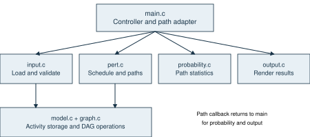
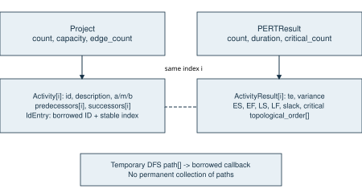
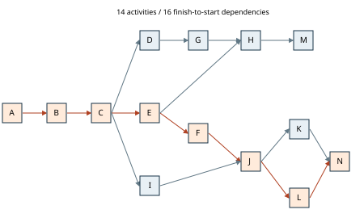
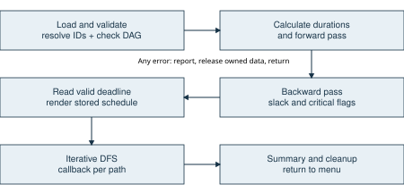

# Design and Implementation of a PERT Scheduling and Probability Analysis System in C

## Abstract

This report presents the design, implementation and verification of a modular C11 system for PERT scheduling and probability analysis. The system models projects as Activity-on-Node directed acyclic graphs and supports keyboard input and a documented six-field CSV format. Activity counts and line buffers grow dynamically, and predecessor references are resolved after all activity IDs have been collected.
The scheduling engine computes three-point expected durations and variances, obtains a Kahn topological order, performs forward and backward passes, and identifies critical activities and tight dependency edges. Iterative depth-first search streams complete critical paths through a synchronous callback. At most 100 paths are emitted; discovery of path 101 stops enumeration and records truncation. Original activity data, calculated results, probability analysis and terminal presentation are separated into distinct modules.
The classroom regression reproduces a 44-day project duration and the path A-B-C-E-F-J-L-N. The path variance is 9, its standard deviation is 3 days, and a 47-day deadline gives Z=1 and an approximate probability of 84.1345%. This is explicitly a traditional PERT single-path normal approximation, not an exact project completion probability. Multiple critical paths are analyzed separately without multiplying dependent path probabilities.
Verification includes all 14 classroom result rows, malformed records, invalid graph structures, fractional durations, deterministic and tiny-variance cases, repeated menu analysis, a 20,000-node chain, the 100-path boundary and 100 independently checked random DAGs. The test runner reports 22 passing groups. Allocation instrumentation checks ownership and cleanup through 97 injected failure positions. AddressSanitizer could not link in the installed MinGW environment, and that limitation is retained in the report and logs.
Keywords: PERT; C11; Activity-on-Node; topological sorting; critical path; dynamic memory; normal approximation.

## Chapter 1  Introduction

### 1.1  Problem and project objectives

A project schedule must express both precedence constraints and uncertainty in activity durations. An activity can begin only after all of its predecessors finish. When several branches proceed in parallel, the longest feasible chain determines the expected completion time under the mean-duration model. A single list of activities therefore cannot explain the schedule: the dependencies and the forward and backward calculations must be visible.

This project implements a complete C11 command-line system for that purpose. Users enter a project through the keyboard or a restricted CSV file, provide optimistic, most likely and pessimistic estimates, and obtain scheduling results and a traditional PERT probability for each displayed critical path. The application accepts different activity counts and arbitrary CSV record ordering. The classroom data are a regression fixture, rather than a special case in the scheduling code.

#### Objectives and observable outcomes

The first objective is to make the calculation inspectable. The report includes original estimates, expected durations, variances, a valid topological order, predecessor-based forward explanations, successor-based backward explanations, and the final ES, EF, LS, LF and slack table. A reader can follow an activity from its input row to its calculated timing constraints.

The second objective is to keep the implementation modular and safe to reuse. Original activity data and calculated results have different owners. The scheduling engine neither parses files nor prints the CLI report. Probability calculation is separate from schedule calculation. A synchronous callback connects path enumeration to probability and presentation without creating dependencies from the engine to those modules.

The third objective is evidence-based verification. The delivered tests check all 14 classroom rows, difficult graph shapes, malformed input, numerical boundaries, repeated interaction and a 20,000-node chain. They also compare 100 shuffled random DAGs against an independent scheduling oracle. Actual output and build logs accompany the source.

#### Scope

Time is measured in days. Dependencies are finish-to-start with zero lag. The system assumes a directed acyclic graph and does not schedule scarce resources or calendars. Probability analysis assumes independent activity durations within each path and uses the normal approximation. These assumptions are stated alongside the output rather than hidden behind a single project-confidence number.

## Chapter 2  Requirements analysis

### 2.1  Functional requirements and traceability

The supplied assignment [1] requires independently designed input, output that explains the algorithm, appropriate data structures, readable source, a PDF report and a compressed source folder. The frozen engineering baseline [3] refines those requirements into the following implementation and verification commitments.

Table 2.1  Functional requirements mapped to implementation

| Requirement | Implementation | Verification |
| --- | --- | --- |
| Variable activity count | Growing Activity and adjacency arrays | 20,000-node chain |
| Keyboard and CSV input | input_keyboard / input_csv | CLI and parser tests |
| Arbitrary record order | Finalize IDs, then resolve references | Shuffled DAG oracle |
| Dependency validation | ID lookup, edge checks, Kahn sort | Invalid graph cases |
| Three-point estimation | pert_calculate | All lecture rows |
| Forward and backward passes | Topological and reverse order | 100 independent DAGs |
| Genuine critical paths | Iterative DFS over tight edges | Fork/merge path tests |
| At most 100 path outputs | Detect path 101, then stop | 256-path and 100-path cases |
| Per-path probability | probability_calculate | Lecture and zero variance |
| Explanatory terminal report | output_schedule and callback | Recorded CLI transcript |
| Recover after errors | Controller cleanup and menu loop | Repeated and invalid input |
| PDF and compressed source | Report and source package | File and archive inspection |

Acceptance is based on behavior, not the presence of named functions alone. For example, arbitrary record order is accepted only when a predecessor declared later resolves correctly and every generated topological order respects the resulting edges. The path limit is accepted only when callbacks stop at 100 and discovery of the next complete path changes the truncation flag.

The deadline is deliberately separate from activity input. It is requested after loading, graph validation and successful scheduling. Invalid input cannot produce a plausible probability report from a partially constructed graph. Once an analysis finishes or is rejected, the controller releases its resources and allows the next project to start.

## Chapter 2  Requirements analysis

### 2.2  Input rules and nonfunctional requirements

#### A precise input contract

CSV records contain exactly six fields: ID, Description, a, m, b and Predecessors. The case-sensitive header is required. A dash represents an empty predecessor set, and a vertical bar separates multiple predecessor IDs. Field whitespace is trimmed, empty physical lines are skipped, LF and CRLF are accepted, and an optional UTF-8 BOM is recognized at the beginning of the file. Empty fields remain distinct during parsing and are rejected.

An ID begins with an ASCII English letter and contains at most 32 letters, digits or underscores. Descriptions contain 1-256 bytes. Commas and embedded newlines are unsupported because this is a documented unquoted CSV dialect. Decimal and scientific notation are accepted for estimates. NaN, infinity, hexadecimal syntax, missing numbers and trailing text are rejected; estimates must satisfy 0 <= a <= m <= b.

#### Reliability and maintainability

All application calculations use double precision without rounding intermediate values. Allocation results and size arithmetic are checked. Error diagnostics use fixed buffers so reporting an allocation failure does not itself allocate memory. Public functions return PertStatus and computed values through output parameters, with ownership requirements in their headers.

No fixed activity limit is imposed. Available memory, platform address space and representable numeric range limit practical inputs. Input lines also grow dynamically; the implementation does not truncate a long record to fit a static buffer. IDs and descriptions have intentional validation limits, distinct from the unbounded number of activities.

Table 2.2  Quality attributes and acceptance evidence

| Attribute | Concrete acceptance evidence |
| --- | --- |
| Portability | C11; GCC build with Wall, Wextra, Wpedantic and Werror |
| Numerical integrity | Fractional, tiny-variance and overflow tests |
| Recoverability | Malformed CSV and keyboard re-entry return safely |
| Memory ownership | Guarded allocations and 97 failure positions |
| Scalability | 20,000-node iterative traversal; no recursive DFS |
| Reproducibility | Fixtures, test source, fixed random seed and saved logs |

The design favors a small set of understandable C modules over infrastructure unrelated to the assignment. It contains no database, graphical interface, third-party PERT library or global mutable project state. A failed project can be discarded without affecting the next analysis.

## Chapter 3  System architecture and design

### 3.1  Modules and coordination

The main controller owns one Project and one PERTResult for each menu iteration. It invokes input, calculation, deadline entry and rendering in sequence. The callback adapter in main.c is the only point that combines a critical path, the probability module and the output module. This keeps the computational engine usable independently of the terminal interface.



model.c manages activity storage, validation, ownership and the sorted lookup index. graph.c inserts dependencies and performs Kahn topological sorting. input.c handles dynamic lines, decimal conversion, temporary predecessor text and source diagnostics. pert.c performs scheduling and path enumeration. probability.c computes statistics from a borrowed path; output.c renders stored values and relationships.

The dependency direction is intentionally one-way. Input uses model and graph; PERT uses graph and common types; probability and output consume common result types. Output never calls pert_calculate. During a path callback, the controller obtains a ProbabilityResult and then renders that path immediately. The PERT engine does not import either probability.h or output.h.

#### Separation of computation and explanation

The terminal explanations reconstruct the operands from stored graph neighbors and stored ES, EF, LS and LF values. They do not run a second scheduling pass. This avoids discrepancies between the algorithm used for the final table and an independently recalculated explanation. The topological order shown to the user is the same order retained by the engine.

## Chapter 3  System architecture and design

### 3.2  Data model and ownership

Activity contains only original data: owned ID and description strings, and a, m and b. ActivityResult contains expected duration, variance, ES, EF, LS, LF, slack and a critical flag. The common position in their respective arrays identifies the same activity. Sorting the ID lookup array never rearranges the original activity array, so graph indices remain stable.



Table 3.1  Objects and lifetime contracts

| Object | Owner and lifetime |
| --- | --- |
| Activity strings and array | Project; from load until project_destroy |
| Predecessor/successor arrays | Project; graph finalization until destruction |
| Sorted IdEntry array | Project; IDs borrowed from owned Activity strings |
| Results and topological order | PERTResult; successful calculation until destruction |
| Pending predecessor text | Input; destroyed after resolution or any failure |
| DFS path and next-edge arrays | Engine; one enumeration call only |
| Path pointer at callback | Borrowed read-only until that callback returns |

Each AdjacencyList stores size_t indices, a count and a capacity. A Project also records activity count/capacity and edge count. A PERTResult records duration and critical-activity count, while PathSummary records only emitted-path count and truncation. No object retains every critical path.

Every public output object must be initialized before use. A failed load or calculation cleans its temporary object before returning; successful completion transfers ownership once. Destruction resets an object to its empty state, so cleanup remains safe after partial initialization.

## Chapter 3  System architecture and design

### 3.3  Activity-on-Node network design

The classroom example is described as Activity-on-Arrow, while this implementation intentionally uses Activity-on-Node. In AON, each activity and its three-point estimate belong to a vertex; a directed edge states a prerequisite. This maps directly to the input row and ActivityResult array. The model avoids introducing event vertices or dummy activities merely to express precedence.



Figure 3.3 contains the 14 activity vertices and 16 dependency edges from lecture_example.csv. A begins the network. M and N are distinct terminal activities. H joins E and G, J joins F and I, and N joins K and L. These joins explain why simply adding activity durations or listing all zero-slack nodes would be insufficient.

Both directions are stored. For u -> v, successors[u] contains v and predecessors[v] contains u. Before an insertion changes either count, the implementation reserves enough capacity in both lists. If the second reservation fails, the first buffer may have grown, but the logical graph remains unchanged. Duplicate edges and self-dependencies are rejected before the commit.

Multiple starts, multiple terminals and disconnected DAG components need no synthetic start or finish activity. Every source has ES=0, and every terminal has LF equal to the overall project duration. Thus an isolated shorter component receives positive slack relative to completion of the complete project.

The figure was generated from the same dependency relationships used in the CSV. No separate lecture screenshots were supplied, so the original estimates and descriptions were checked against the user-provided baseline [3], not against an unavailable image.

## Chapter 4  PERT algorithm design

### 4.1  Estimation and topological ordering

#### Three-point estimates

For each activity, the classroom model defines expected duration te=(a+4m+b)/6 and variance V=((b-a)/6)^2. Expected duration is measured in days and variance in days squared. The estimates represent input assumptions; the program does not learn or fit them from historical data.

```text
te = a + (m - a) * (2.0 / 3.0) + (b - a) / 6.0
spread = (b - a) / 6.0
variance = spread * spread
```

The implemented duration expression is algebraically identical to the classroom expression. It avoids evaluating 4*m at very large magnitudes and preserves a deterministic duration exactly when a=m=b. A positive spread that squares to zero is rejected as unrepresentable rather than silently converted into a deterministic activity. Non-finite results are rejected.

#### Kahn topological sort

```text
degree[i] = number of predecessors of i
queue = all vertices with degree zero
head = 0
while head < queue length:
    u = queue[head]; head += 1
    for each v in successors[u]:
        degree[v] -= 1
        if degree[v] == 0: append v to queue
if queue length != activity count: return CYCLE
return queue as the topological order
```

Kahn sorting [4] operates on copied indegrees. It does not remove graph edges or modify the stored adjacency lists. Every vertex enters the queue at most once, when all predecessor edges have been accounted for. If fewer than V vertices are removed, at least one cyclic dependency prevents completion. A self-edge has already been rejected during input resolution.

The queue doubles as the returned topological order. This avoids a separate output array while retaining O(V) working space. Sorting scans each vertex and edge once, giving O(V+E) time. Multiple valid orders can exist; the implementation follows input-index order for initial sources and adjacency insertion order thereafter. Tests require dependency correctness rather than a single arbitrary ordering.

## Chapter 4  PERT algorithm design

### 4.2  Forward and backward scheduling passes

The forward pass visits the topological order. A source receives ES=0; any other activity receives the maximum EF of its predecessors. EF=ES+te. The project duration T is the maximum EF over all activities. Because activity durations are nonnegative, this also equals the maximum terminal finish time.



The backward pass visits the order in reverse. Every terminal receives LF=T. For a nonterminal, LF is the minimum LS of its successors. LS=LF-te and slack=LS-ES. This expresses how far an activity may move without extending the mean-duration schedule. A critical flag is set when slack is within the centralized absolute tolerance of zero.

#### Worked join and branch examples

At J, F finishes at day 25 and I finishes at day 23, so ES(J)=max(25,23)=25. J lasts 8 days and finishes at 33. In the backward pass, K starts as late as 34 and L starts as late as 33, so LF(J)=min(34,33)=33 and LS(J)=25. Its slack is zero.

H is controlled by G in the forward direction: max(EF(E),EF(G))=max(20,29)=29. Its latest finish is LS(M)=42, and LS(H)=42-9=33. H therefore has four days of slack. The graph and the stored results supply every operand printed in these explanations.

Both passes have O(V+E) time and O(V) result storage. Overflow, non-finite values and a negative slack beyond tolerance produce a numeric error instead of a misleading result. A positive duration lost entirely when added to a large ES is also rejected.

## Chapter 4  PERT algorithm design

### 4.3  Critical edges and iterative path enumeration

A critical path must follow actual dependencies between a source and a terminal. A candidate edge u -> v must exist, both endpoints must be critical, and EF(u) must be approximately ES(v). The existence check is explicit in the public edge predicate; DFS already walks existing successor entries and applies the same timing predicate privately.

```text
allocate path[V] and next_edge[V]
for each critical source:
    push(source, next_edge = 0)
    while stack is not empty:
        u = current path endpoint
        if u is terminal:
            verify sum(path durations) agrees with T
            if emitted == 100:
                truncated = true; stop
            callback(path, length, context, error)
            propagate callback error; otherwise emitted += 1
            pop u
        else if another tight critical successor exists:
            push that successor
        else:
            pop u
free both buffers on every exit
```

The stack is an explicit heap array, not the C call stack. next_edge stores the successor position to resume after a child is finished. This is why the 20,000-activity chain can be traversed without recursive stack depth. The path buffer contains only the currently explored chain and is never copied into permanent path storage by the engine.

The callback is synchronous and returns PertStatus. Its path pointer is borrowed and read-only: it must not be modified, freed or retained after return. The controller calculates a ProbabilityResult and prints the path before returning. A callback error stops enumeration and releases both traversal arrays.

After 100 successful callbacks, exploration continues only until the next complete path is discovered. Path 101 is validated but is not passed to the callback; its discovery marks truncation and stops the search. Exactly 100 existing paths therefore produces emitted=100 and truncated=false, while the 256-path fixture produces emitted=100 and truncated=true.

Enumeration is output-sensitive and can be exponential if all paths are requested in a general DAG. The display cap limits emitted complete paths and stops discovery at 101. Auxiliary traversal memory is O(V); work includes explored successor entries plus path-length validation and callback processing. The report never interprets 100 emitted paths as an exact total when truncation is true.

## Chapter 4  PERT algorithm design

### 4.4  Precision and completion probability

The common pert_close helper compares finite values using |x-y| <= 1e-9 days. The comparison is absolute and local to a slack or timing difference; it is not multiplied by the total project duration. This prevents a one-day difference at a trillion-day scale from becoming critical under an excessively broad relative tolerance. Intermediate results remain double values with no display rounding fed back into the calculation.

#### Traditional single-path approximation

```text
path_mean = sum(te for activities on the path)
path_variance = sum(V for activities on the path)
sigma = sqrt(path_variance)
Z = (deadline - path_mean) / sigma
P = 0.5 * erfc(-Z / sqrt(2.0))
```

The C library erfc expression evaluates the standard-normal cumulative probability [5]. Under the independent-activity assumption, variances add along a path. For the classroom critical path, the mean is 44, variance is 9 and sigma is 3. At deadline 47, Z=1 and the computed probability is 0.8413447461, displayed as 84.1345% or 84.13% to two decimals.

#### Zero variance and multiple paths

Variance is considered zero only when its stored value is exactly zero. A duration tolerance would be dimensionally inappropriate and could incorrectly turn a small positive variance into a deterministic case. With zero variance, completion on or before the deadline has probability one if D >= path_mean and zero otherwise. Z is not calculated and is printed as not applicable.

If several critical paths exist, the system reports an approximation separately for every emitted path. Shared activities can make path durations dependent even if individual activity durations are independent. Multiplying path probabilities would therefore be unjustified. The program also does not select the first path and relabel its probability as the exact project completion probability.

A near-critical path can become the longest under uncertain durations, so the single-critical-path approximation remains limited even when the expected schedule has one critical path. Truncated enumeration introduces a further limitation: only the displayed subset has been analyzed. Non-finite variance sums and Z-scores are rejected. Extremely large or finely separated time scales may also exceed the conservative absolute tolerance or the representable precision of double.

## Chapter 5  System implementation

### 5.1  Parsing and dependency resolution

input_read_line starts with a small heap buffer and grows it geometrically when needed. Every growth checks capacity arithmetic and retains the old pointer until realloc succeeds. A final line without a newline is valid. A NUL byte is rejected explicitly; the remainder of that physical line is drained so interactive input does not resume in the middle of a rejected field.

The CSV splitter scans for commas and writes terminators in place. It does not use strtok, whose treatment of consecutive delimiters could hide missing fields. It counts exactly six fields, trims surrounding whitespace and then rejects empty values. A header check precedes every activity record. File diagnostics retain the physical line number even when blank lines are skipped.

#### Two-phase project loading

```text
for each validated CSV record:
    append owned Activity strings and estimates
    retain predecessor text and physical source line
finalize activity collection
build sorted (ID, stable index) lookup array
reject adjacent equal IDs in that sorted array
for each activity:
    resolve predecessor tokens by binary search
    add validated edges
run Kahn cycle validation
transfer completed Project to caller
```

Temporary predecessor strings are owned by the input module and destroyed after success or failure. Unknown tokens identify both the target activity and the offending predecessor in the diagnostic. Duplicate IDs are detected after all records have been collected; the diagnostic identifies a corresponding duplicate record line. A global cycle error does not invent a single responsible activity.

Keyboard input uses the same ID, description, decimal and estimate validation routines. It collects activities before asking for dependencies, allowing later IDs to be referenced. Invalid fields are re-entered. If a predecessor list fails after adding some edges, those edges are rolled back before re-entry. A complete cyclic graph is rejected and control returns to the menu so a new project can be started.

CSV ID index construction is O(V log V) and binary-search reference resolution is O(E log V), apart from string comparisons and duplicate-edge checks. Keyboard duplicate-ID checking scans earlier activities. Duplicate-edge detection scans the shorter of the relevant predecessor and successor lists, so validation is not claimed to have a universal O(V+E) bound.

## Chapter 5  System implementation

### 5.2  Allocation discipline and error contracts

PertStatus distinguishes input, file, memory, duplicate, reference, cycle, numeric and internal failures. PertError carries status, physical source line when applicable, a bounded activity ID and a bounded explanatory message. The error helper uses fixed buffers and does not depend on a successful allocation. This is necessary when the original failure is exhaustion of memory.

Table 5.1  Representative public contracts

| Function | Precondition and outcome |
| --- | --- |
| project_add | Unfinalized project; copies strings; safe cleanup on failure |
| project_finalize | Nonempty collection; freezes indices and builds lookup/graph |
| graph_add_edge | Valid finalized endpoints; both logical sides commit together |
| graph_topological | Finalized project; returns owned order or NULL on failure |
| input_csv | Empty initialized output; transfers only a complete valid graph |
| pert_calculate | Empty initialized result; produces schedule without I/O |
| pert_enumerate_paths | Matching valid project/result; borrows callback context |
| probability_calculate | Borrows path/result; returns statistics without printing |

Array capacity is separate from count. Capacity may increase on an operation that later fails, but count changes only after the operation can commit. This distinction is particularly important for a graph edge: reserving successors[u] must not expose an edge before predecessors[v] can also accept it. Both append operations occur only after successful reservations.

The project destructor releases every initialized string and adjacency buffer, then the containing arrays and lookup index, and resets the structure. The result destructor releases the activity-result array and topological order. Input cleanup frees only the predecessor strings that were actually allocated. The main controller calls both destructors at the end of every analysis, including error paths.

Public computational functions assume the documented object lifetimes and valid pointers. They do not attempt to protect against arbitrary caller memory corruption. Caller-owned output objects must be empty before being overwritten; the controller and tests satisfy this contract. A callback must respect its borrowed buffer lifetime. These constraints are explicit rather than hidden in implementation assumptions.

## Chapter 5  System implementation

### 5.3  Build and command-line workflow

The delivered application consists of seven C source modules and seven public headers. GCC compiles the complete program directly; GNU Make is optional. The verified environment is Windows with MinGW-w64 GCC 8.1.0. The C11 warning set is enabled, and verification adds -Werror so a warning fails the build. The older MinGW runtime requires its ANSI stdio mode for standard size_t formatting; that compatibility definition is centralized before stdio headers.

```text
gcc -std=c11 -Wall -Wextra -Wpedantic -O2 -Iinclude \
  src/main.c src/model.c src/input.c src/graph.c \
  src/pert.c src/probability.c src/output.c -o pert.exe -lm

Windows execution:  .\pert.exe
```

The displayed command is wrapped for readability; README.md supplies a single-line PowerShell command. The Makefile builds the same application and a C-only core test executable. GNU Make was not installed in the verification environment, so the direct GCC commands were executed and the optional Makefile recipes were not independently run.

```text
PERT Scheduling and Probability Analysis
1. Load CSV
2. Enter project by keyboard
0. Exit

Lecture interaction:
Choice: 1
CSV filename: data/lecture_example.csv
Target deadline (days): 47
```

The report has ten numbered sections. Timing tables normally use four decimal places; probability output uses four decimal places as a percentage. Small nonzero slack switches to significant-digit display so a noncritical activity is not visually presented as zero slack. Explanations and path summaries use additional significant digits to make the calculation reproducible.

Invalid menu selections are re-entered. An invalid deadline is re-entered without discarding the valid project. Input ending during project entry cancels that analysis and exits cleanly. A CSV file failure, invalid dependency or cycle returns to the menu. If an error occurs while probabilities are streamed, the output explicitly marks the analysis incomplete instead of printing a successful summary.

Source paths in the README are relative to the extracted PERT_Project directory. CSV filenames may contain spaces and are entered without surrounding quotes. No Python component is needed to build or run the application; Python is used only by the auxiliary test runner and report preparation.

## Chapter 6  Testing and results

### 6.1  Verification design and required coverage

Testing combines fixed numerical oracles, graph invariants, user-interface integration, randomized comparison and allocation instrumentation. The C tests assert computed values directly through the public APIs; the integration tests exercise the actual executable and its terminal output. The random oracle uses a fixed seed and independently implements scheduling over generated DAGs.

Table 6.1  Mandatory test coverage

| Required case | Executed evidence |
| --- | --- |
| Classroom example | All 14 rows, critical flags, exact chain and probability |
| Single activity | One-node schedule and deterministic boundary |
| Multiple starts / ends | Merge and branch schedules |
| Disconnected components | Shorter component receives global-project slack |
| Unsorted CSV | Future references and 100 shuffled random DAGs |
| Multiple critical paths | Two-branch fork/join and all-zero network |
| More than 100 paths | 256 paths; 100 callbacks; truncation true |
| Cycle / duplicate IDs | Rejected without transferring a Project |
| Duplicate / unknown / self edges | Status and source diagnostics checked |
| Invalid estimates | Negative, reversed, NaN, infinity, junk and hex |
| Malformed CSV / empty fields | Wrong field counts, missing header and fields |
| Zero variance | D=mean gives one; slightly earlier gives zero |
| Fractional duration | Two-activity chain totals one third |
| Numerical overflow | Input range, variance and accumulated EF |
| Large dynamic network | 20,000 nodes, 19,999 edges and one long path |
| Repeated interactive analyses | Two projects in the same executable session |

Additional tests cover an exact 100-path network, tiny positive variance, small noncritical slack, a trillion-day local comparison, callback cancellation, EOF recovery, a BOM, CRLF, long lines, ID/description length boundaries and case-sensitive IDs. The distinction between exactly 100 paths and truncation at path 101 is an explicit regression boundary.

The Python runner is auxiliary tooling, not application logic. It compiles the application and C tests, records command output, creates temporary CSV files, runs interactive transcripts and writes a structured summary. It stops with a nonzero result if an assertion fails.

## Chapter 6  Testing and results

### 6.2  Complete classroom regression results

The classroom input has 14 activities and 16 dependencies. Table 6.2 contains the verified stored scheduling results; printed variances are rounded only for presentation. The C oracle checks expected duration, variance, ES, EF, LS, LF, slack and critical status for every row. The project duration is 44 days.

Table 6.2  All 14 verified classroom result rows

| ID | te | V | ES | EF | LS | LF | Slack | Crit. |
| --- | --- | --- | --- | --- | --- | --- | --- | --- |
| A | 2 | 0.1111 | 0 | 2 | 0 | 2 | 0 | Yes |
| B | 4 | 1 | 2 | 6 | 2 | 6 | 0 | Yes |
| C | 10 | 4 | 6 | 16 | 6 | 16 | 0 | Yes |
| D | 6 | 1 | 16 | 22 | 20 | 26 | 4 | No |
| E | 4 | 0.4444 | 16 | 20 | 16 | 20 | 0 | Yes |
| F | 5 | 1 | 20 | 25 | 20 | 25 | 0 | Yes |
| G | 7 | 1 | 22 | 29 | 26 | 33 | 4 | No |
| H | 9 | 4 | 29 | 38 | 33 | 42 | 4 | No |
| I | 7 | 1 | 16 | 23 | 18 | 25 | 2 | No |
| J | 8 | 1 | 25 | 33 | 25 | 33 | 0 | Yes |
| K | 4 | 0 | 33 | 37 | 34 | 38 | 1 | No |
| L | 5 | 1 | 33 | 38 | 33 | 38 | 0 | Yes |
| M | 2 | 0.1111 | 38 | 40 | 42 | 44 | 4 | No |
| N | 6 | 0.4444 | 38 | 44 | 38 | 44 | 0 | Yes |

```text
Critical path: A -> B -> C -> E -> F -> J -> L -> N
Expected path duration = 2+4+10+4+5+8+5+6 = 44
Path variance = 1/9+1+4+4/9+1+1+1+4/9 = 9
Standard deviation = sqrt(9) = 3 days
Deadline = 47 days; Z = (47-44)/3 = 1
Traditional PERT completion approximation = 84.1345%
```

The two terminal activities illustrate the global backward boundary condition. M finishes at day 40 in the forward pass but receives LF=44, giving four days of slack. N finishes at day 44 and has zero slack. K has zero activity variance but one day of schedule slack; these are different quantities and must not be conflated.

A recorded application run is retained as tests/results/lecture_output.txt. It includes the original estimates and the operands for both passes, not just this summary table. The schedule and probability are computed from the CSV; no lecture-specific branches or hardcoded answers exist in the C engine.

## Chapter 6  Testing and results

### 6.3  Executed results and independent comparison

The final automated runner completed successfully on the local Windows environment. It recorded 22 passing test groups and one unavailable checker, AddressSanitizer. The normal core executable completed 62,547 assertions; the allocation-instrumented executable completed 62,745 assertions. These counts include per-node and per-edge checks in the large-chain test rather than representing that many independent scenarios.

Table 6.3  Actual verification outcomes

| Verification | Observed result |
| --- | --- |
| GCC C11 warning-free build | PASS with -Wall -Wextra -Wpedantic -Werror |
| Core regression executable | PASS; 62,547 assertions |
| Instrumented core executable | PASS; 62,745 assertions |
| Allocation failure sweep | PASS; 97 failing positions plus successful run |
| Large chain | PASS; 20,000 nodes and one 20,000-node path |
| Path truncation | PASS; 100 emitted of 256 possible paths |
| Exactly 100 paths | PASS; truncation false |
| CLI and file boundary tests | PASS; included in 22 groups |
| Independent random oracle | PASS; 100 DAGs with shuffled CSV order |
| AddressSanitizer link attempt | UNAVAILABLE; linker cannot find -lasan |

The random oracle generates 2-18 activities with positive integer deterministic durations. Edges connect only earlier generated nodes to later nodes, guaranteeing a DAG before CSV order is shuffled. A separate Python calculation obtains ES, EF, LS, LF and slack. Each activity row from the actual executable is compared with those values, and each emitted path is checked for real edges, source/terminal endpoints and total duration.

Deterministic integer cases isolate scheduling correctness from approximation error. Fixed fractional and variance tests cover the mathematical behavior that those random cases do not exercise. The suite therefore combines independent comparisons with deliberately chosen boundary fixtures rather than treating random testing alone as proof.

The saved summary is tests/results/summary.json. Build logs, core output, memory output, the failed sanitizer-link diagnostic, and the lecture and keyboard transcripts are retained in the same directory. The tests claim no timing benchmark, exhaustive proof over all inputs or successful sanitizer run.

## Chapter 6  Testing and results

### 6.4  Memory checks and defect-driven improvements

The installed GCC toolchain could not link an AddressSanitizer build because its runtime library was unavailable. The compiler documentation describes sanitizer capabilities [6], but that does not establish support in a particular installation. The actual linker diagnostic is retained, and AddressSanitizer is reported as unavailable rather than passed.

#### Allocation tracking and injected failure

A test-only forced-include header redirects malloc, realloc and free calls in project and test source to an allocation probe. Production builds still call the normal C allocation functions. The probe tracks live blocks, validates frees, adds a 16-byte tail guard, and can fail an allocation after a selected number of successful allocations. Its own bookkeeping uses unredirected allocation.

The complete core suite runs with this instrumentation. It then repeats the classroom load, calculation and enumeration workflow, failing successively at each of 97 allocation positions. Every failing run returns a memory status, releases all tracked blocks, and leaves no altered tail guard. The next run succeeds. This exercises partial input records, graph construction, sorting, results and traversal cleanup.

This probe is narrower than AddressSanitizer. It does not detect arbitrary invalid reads, every out-of-bounds write, or every use-after-free access. It also does not prove all untested allocation paths are correct. The evidence supports the tested ownership and failure-cleanup contracts, while a full sanitizer run remains a useful follow-up on a supporting toolchain.

#### Precision defect found and corrected

A large-scale deterministic regression initially exposed rounding in a split weighted-sum implementation of the expected-duration formula. Two deterministic independent activities differing by one day at roughly 10^12 days did not retain the expected slack accurately enough for the test. The implementation changed to a difference form that is algebraically identical to PERT and returns a exactly when a=m=b. The large-scale regression then passed.

The correction did not change the frozen mathematical model or round values to match the fixture. It improved the evaluation of the same formula and was followed by a complete regression rerun. The 20,000-node chain separately verifies dynamic growth and iterative depth handling, but it is a capacity test, not a universal performance claim.

## Chapter 7  Conclusion

### 7.1  Outcomes limitations and future work

The implemented system satisfies the engineering behavior required for variable-size PERT analysis: independently designed keyboard/CSV input, stable graph indices, dual adjacency lists, cycle detection, complete forward and backward passes, genuine critical paths, separate probability calculation and an explanatory command-line report. It compiles as C11 with GCC and does not rely on a third-party PERT library.

Verification reproduces the classroom duration of 44 days and the A-B-C-E-F-J-L-N critical path. The path variance is 9 and the 47-day normal approximation is 84.1345%. All classroom rows are checked, along with large networks, malformed input, repeated analyses, path truncation, independently generated DAG schedules and injected allocation failures.

#### Remaining technical limitations

Traditional PERT single-path probability is an approximation. Shared activities create dependence between path durations, and near-critical paths can become controlling under uncertainty. The system reports these limitations explicitly and does not combine per-path probabilities into an unsupported project estimate. A 100-path output cap makes large path families manageable but intentionally leaves the exact total unknown after truncation.

Double arithmetic has finite precision and range. The absolute tolerance avoids overly broad comparisons at large scales but can conservatively reject numerically inconsistent extreme inputs. The parser supports a documented restricted CSV dialect, not quoted commas or multiline fields. Terminal output grows with the activity count. Resource limits, working calendars and dependency types other than finish-to-start with zero lag remain outside scope.

#### Prioritized future improvements

The first follow-up is running the same core tests under AddressSanitizer and UndefinedBehaviorSanitizer on a toolchain with the required runtimes. Additional failure-injection scenarios could cover more keyboard and uncommon malformed-file paths. A larger collection of externally reviewed schedule oracles would further strengthen verification.

A later extension could add a machine-readable report export without changing the computational engine. Monte Carlo project simulation could investigate path switching and shared-activity effects, but it would be a separately approved model extension rather than a relabeling of the current normal approximation. Resource leveling and calendar support would likewise need new requirements and data contracts.

The source package contains the implementation, headers, fixtures, tests, actual logs, original assignment documents and an English README with direct GCC commands. The report and compressed source are the two required submission artifacts; the assignment specifies the student-number and student-name filename convention and a normal deadline of 09:00 on 1 October 2026, with a same-day 23:59 cutoff [1].

## References

[1] Supplied course document. Assignment for Chapter2-Implementation of PERT model-2026.09.10. Original assignment PDF retained with the source package.
[2] Supplied institutional template. Cover Page for homework-2026.09.10.docx. Macau University of Science and Technology, School of Computer Science and Engineering, Faculty of Innovation Engineering.
[3] User-supplied engineering specification. PERT Scheduling and Probability Analysis System in C. Frozen design baseline and classroom regression data, provided with this project request.
[4] A. B. Kahn. Topological sorting of large networks. Communications of the ACM, 5(11), 558-562, 1962. https://doi.org/10.1145/368996.369025
[5] NIST/SEMATECH. e-Handbook of Statistical Methods. Section 1.3.6.6.1, Normal Distribution. https://www.itl.nist.gov/div898/handbook/eda/section3/eda3661.htm (accessed 18 September 2026).
[6] GNU Project. Using the GNU Compiler Collection. Instrumentation Options. https://gcc.gnu.org/onlinedocs/gcc/Instrumentation-Options.html (accessed 18 September 2026).